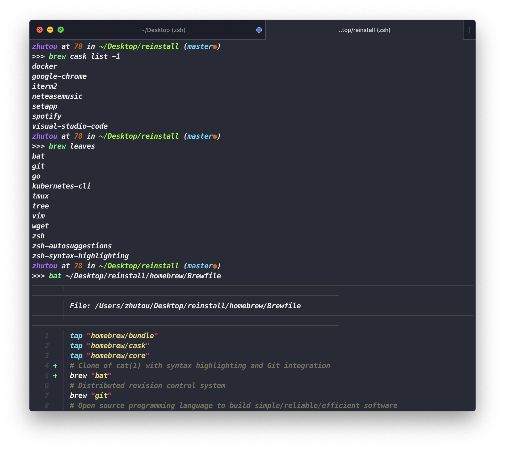

## 重装macOS
想要一个比 Time Machina 备份更 "干净" 的系统。  
设置三指拖移，缩放更多空间，夜览。

### 利用 [homebrew bundle](homebrew/README.md) 优雅的备份与恢复软件

### dotfiles
- [x] [tmux](tmux/README.md)
- [x] [vscode Settings Sync](vscode/README.md)
- [x] [iterm2](iterm2/README.md)
- [x] [oh-my-zsh](oh-my-zsh/README.md)
- [x] [ssh config](ssh/README.md)
- [x] [vim config](vim/README.md)
- [ ] [k8s kube config]()
- [ ] [transmit]()
- [ ] [SwitchyOmega]()

## github config
[Connecting to GitHub with SSH](https://help.github.com/en/github/authenticating-to-github/connecting-to-github-with-ssh)

2222
## TODO
- [ ] 搞成自动化脚本
