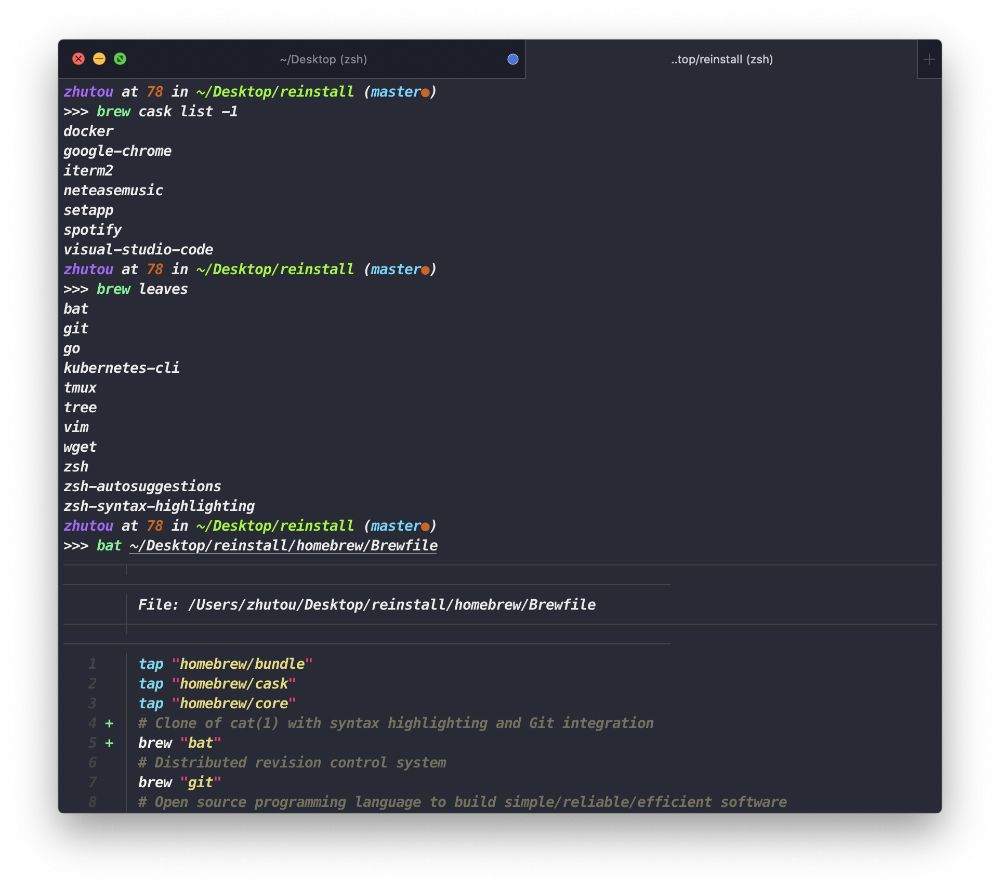

## 重装macOS
想要一个比 Time Machina 备份更 "干净" 的系统
### 利用 homebrew bundle 优雅的备份与恢复软件

### 配置文件
- vscode 通过「settings Sync」 插件备份同步
- iterm2 导出 profile.json
- k8s kube config
- ssh config
- transmit config
- SwitchyOmega config
- vim config
